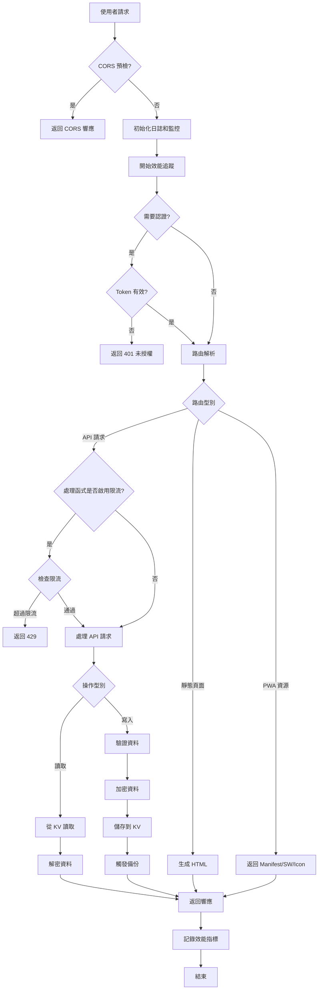
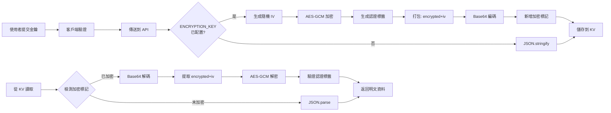
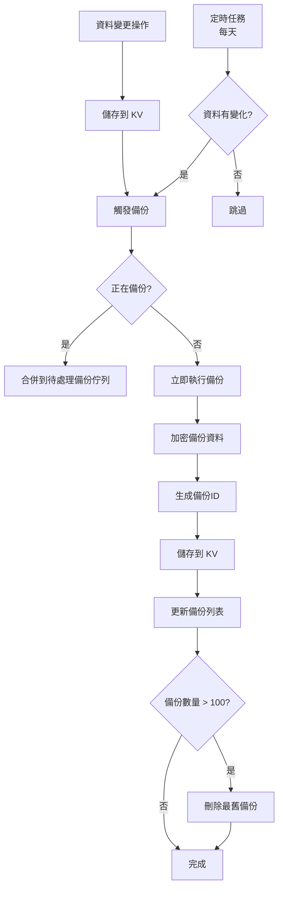

# 🏗️ 專案架構文件

## 📋 目錄

- [總體架構](#總體架構)
- [技術棧](#技術棧)
- [程式碼結構](#程式碼結構)
- [核心模組詳解](#核心模組詳解)
- [資料流](#資料流)
- [前端架構](#前端架構)
- [設計模式](#設計模式)

---

## 總體架構

### 三層架構

```
┌─────────────────────────────────────────────────────┐
│                   使用者層                             │
│   瀏覽器 / PWA / 移動裝置                            │
└──────────────────┬──────────────────────────────────┘
                   │ HTTPS
                   ▼
┌─────────────────────────────────────────────────────┐
│              Cloudflare Edge                        │
│   CDN + DDoS 保護 + SSL + 全球分佈                  │
└──────────────────┬──────────────────────────────────┘
                   │
                   ▼
┌─────────────────────────────────────────────────────┐
│          Cloudflare Workers（應用層）                │
│  ┌─────────────┐  ┌─────────────┐  ┌────────────┐ │
│  │  路由處理   │  │  API服務    │  │  UI渲染    │ │
│  └─────────────┘  └─────────────┘  └────────────┘ │
│  ┌─────────────┐  ┌─────────────┐  ┌────────────┐ │
│  │  認證系統   │  │  加密系統   │  │  監控系統  │ │
│  └─────────────┘  └─────────────┘  └────────────┘ │
└──────────────────┬──────────────────────────────────┘
                   │
                   ▼
┌─────────────────────────────────────────────────────┐
│        Cloudflare KV（資料儲存層）                   │
│   全球分散式鍵值儲存 + 自動加密 + 低延遲             │
└─────────────────────────────────────────────────────┘
```

### 核心特性

- **無伺服器架構**: 基於 Cloudflare Workers，無需維護伺服器
- **全球分佈**: 在全球 300+ 個城市的邊緣節點上執行
- **高可用性**: 自動故障轉移和負載均衡
- **低延遲**: 就近服務，平均響應時間 < 50ms
- **自動擴充套件**: 根據流量自動擴縮容
- **零冷啟動**: V8 隔離技術，無冷啟動延遲

---

## 技術棧

### 後端

| 技術                   | 用途       | 版本      |
| ---------------------- | ---------- | --------- |
| **Cloudflare Workers** | 執行時環境 | V8 Engine |
| **ES Modules**         | 模組系統   | ES2022    |
| **Web Crypto API**     | 加密操作   | 標準 API  |
| **Cloudflare KV**      | 資料儲存   | -         |

### 前端

| 技術                    | 用途       | 說明                      |
| ----------------------- | ---------- | ------------------------- |
| **HTML5**               | 頁面結構   | 語義化標籤                |
| **CSS3**                | 樣式系統   | 模組化 CSS                |
| **JavaScript (ES2022)** | 互動邏輯   | 原生 JS，無框架           |
| **PWA**                 | 應用增強   | Service Worker + Manifest |
| **jsQR**                | 二維碼識別 | CDN 引入                  |
| **qrcode-generator**    | 二維碼生成 | CDN 引入                  |

### 開發工具

| 工具             | 用途             |
| ---------------- | ---------------- |
| **Wrangler CLI** | 開發和部署工具   |
| **Git**          | 版本控制         |
| **Node.js**      | 構建工具執行環境 |

---

## 程式碼結構

### 主要目錄結構

下圖展示主要模組，完整檔案清單以 `src/` 目錄為準。OTP 的 HMAC 與 Base32 實現在 `otp/generator.js`，資料加密使用 `utils/encryption.js`，密碼雜湊和 JWT 使用 `utils/auth.js`；加密運算呼叫 Web Crypto API。

```
src/
├── worker.js                      # 🎯 Worker 主入口
│                                  # - Fetch 事件處理
│                                  # - CORS 處理
│                                  # - 全域性錯誤捕獲
│                                  # - 監控系統初始化
│
├── router/
│   └── handler.js                 # 🛣️ 路由處理器
│                                  # - 路徑解析和分發
│                                  # - 認證檢查
│                                  # - API 路由對映
│
├── api/
│   ├── secrets/                   # 🔌 金鑰管理 API（模組化）
│   │   ├── index.js              # 統一匯出（Barrel Export）
│   │   ├── shared.js             # 共享工具（saveSecretsToKV, getAllSecrets）
│   │   ├── crud.js               # CRUD 操作
│   │   ├── batch.js              # 批次匯入
│   │   ├── backup.js             # 備份建立和列表
│   │   ├── restore.js            # 備份恢復和匯出
│   │   └── otp.js                # OTP 生成
│   └── favicon.js                 # 🌐 Favicon 代理 API
│
├── otp/
│   └── generator.js               # 🔐 OTP 演算法實現
│                                  # - TOTP (RFC 6238)
│                                  # - HOTP (RFC 4226)
│                                  # - Base32 編解碼
│
├── ui/
│   ├── page.js                    # 🎨 主頁面生成
│   │                              # - HTML 結構
│   │                              # - 樣式整合
│   │                              # - 指令碼整合
│   │
│   ├── quickOtp.js                # 🔢 公開 OTP 輸入與驗證碼頁面
│   ├── standalone.js              # 🖥️ 獨立頁面共享 Fluent 主題
│   ├── offlinePage.js             # 📴 離線兜底頁面
│   ├── setupPage.js               # 🔧 首次設定頁面
│   ├── dialogIcons.js             # 🧩 對話方塊 SVG 圖示
│   │
│   ├── manifest.js                # 📱 PWA Manifest
│   │                              # - 應用資訊
│   │                              # - 圖示定義
│   │                              # - 快捷方式
│   │
│   ├── serviceworker.js           # ⚙️ Service Worker
│   │                              # - 快取策略
│   │                              # - 離線支援
│   │                              # - CDN 資源快取
│   │
│   ├── scripts/                   # 📜 前端 JavaScript 模組
│   │   ├── index.js              # 模組整合入口
│   │   ├── state.js              # 全域性狀態管理
│   │   ├── time.js               # 時間校準
│   │   ├── auth.js               # 認證邏輯
│   │   ├── otp.js                # OTP 計算與動效
│   │   ├── ui.js                 # 主題與彈窗互動
│   │   ├── search.js             # 搜尋與顯示控制
│   │   ├── settings.js           # 設定面板
│   │   ├── core.js               # 核心業務邏輯
│   │   ├── serviceAggregation.js # 服務分組
│   │   ├── utils.js              # 工具函式
│   │   ├── pwa.js                # PWA 功能
│   │   └── moduleLoader.js       # 懶載入模組入口
│   │
│   └── styles/                    # 🎨 前端 CSS 模組
│       ├── index.js              # 樣式整合入口
│       ├── variables.js          # 主題變數和過渡
│       ├── base.js               # 基礎樣式
│       ├── components.js         # 元件樣式
│       ├── modals.js             # 模態框樣式
│       ├── responsive.js         # 響應式樣式
│       ├── progress.js           # 共享進度條常量
│       ├── workspace.js          # Fluent 2 工作區
│       ├── dialogs.js            # Fluent 2 對話方塊
│       ├── setup.js              # 首次設定頁
│       └── backupDocument.js     # HTML 備份文件
│
└── utils/                         # 🛠️ 工具模組
    ├── auth.js                    # 🔑 認證系統
    │                              # - Token 驗證
    │                              # - HttpOnly Cookie
    │                              # - 自動重新整理
    │
    ├── backup.js                  # 💾 智慧備份系統
    │                              # - 事件驅動備份
    │                              # - 併發合併 / 後臺執行
    │                              # - 自動清理
    │
    ├── constants.js               # 📋 常量定義
    │                              # - KV 鍵名
    │                              # - 配置常量
    │
    ├── encryption.js              # 🔒 資料加密
    │                              # - AES-GCM 256
    │                              # - 金鑰派生
    │                              # - 自動加解密
    │
    ├── errors.js                  # ❌ 統一錯誤分類
    │                              # - 自定義錯誤類
    │                              # - 錯誤處理和響應格式
    │
    ├── logger.js                  # 📝 日誌系統
    │                              # - 結構化日誌
    │                              # - 效能計時
    │                              # - 日誌級別
    │
    ├── monitoring.js              # 📊 監控系統
    │                              # - 錯誤追蹤
    │                              # - 效能監控
    │
    ├── rateLimit.js               # 🛡️ 請求限流
    │                              # - 滑動視窗演算法
    │                              # - 可配置策略
    │                              # - 基於 KV 儲存
    │
    ├── response.js                # 📡 響應工具
    │                              # - 標準化響應格式
    │                              # - CORS 頭處理
    │
    ├── security.js                # 🔒 安全工具
    │                              # - CORS 配置
    │                              # - CSP 頭
    │                              # - 預檢請求
    │
    └── validation.js              # ✅ 資料驗證
                                   # - Base32 驗證
                                   # - 輸入校驗
                                   # - 業務規則檢查
```

---

## 核心模組詳解

### 1. Worker 主入口 (`worker.js`)

**職責**: Cloudflare Worker 的入口點，處理所有傳入請求

**核心功能**:

```javascript
export default {
	async fetch(request, env, ctx) {
		// 1. 初始化日誌和監控
		// 2. 處理 CORS 預檢請求
		// 3. 開始請求追蹤
		// 4. 呼叫路由處理器
		// 5. 記錄響應和效能指標
		// 6. 全域性錯誤處理
	},

	async scheduled(event, env, ctx) {
		// 定時任務：自動備份（每天）
	},
};
```

**整合的系統**:

- 日誌系統 (`logger.js`)
- 監控系統 (`monitoring.js`)
- 路由處理 (`router/handler.js`)
- CORS 處理 (`utils/security.js`)

---

### 2. 路由處理器 (`router/handler.js`)

**職責**: 解析 URL 路徑並分發到對應的處理函式

**路由表**:

| 路由                       | 方法   | 處理器                    | 認證 |
| -------------------------- | ------ | ------------------------- | ---- |
| `/`                        | GET    | `createMainPage()`        | ❌   |
| `/setup`                   | GET    | `createSetupPage()`       | ❌   |
| `/manifest.json`           | GET    | `createManifest()`        | ❌   |
| `/sw.js`                   | GET    | `createServiceWorker()`   | ❌   |
| `/icon-*.png`              | GET    | `createDefaultIcon()`     | ❌   |
| `/modules/{name}`          | GET    | `getModuleCode()`         | ✅   |
| `/api/setup`               | POST   | `handleFirstTimeSetup()`  | ❌   |
| `/api/login`               | POST   | `handleLogin()`           | ❌   |
| `/api/refresh-token`       | POST   | `handleRefreshToken()`    | ✅   |
| `/api/secrets`             | GET    | `handleGetSecrets()`      | ✅   |
| `/api/secrets`             | POST   | `handleAddSecret()`       | ✅   |
| `/api/secrets/{id}`        | PUT    | `handleUpdateSecret()`    | ✅   |
| `/api/secrets/{id}`        | DELETE | `handleDeleteSecret()`    | ✅   |
| `/api/secrets/batch`       | POST   | `handleBatchAddSecrets()` | ✅   |
| `/api/secrets/export`      | POST   | `handleExportSecrets()`   | ✅   |
| `/api/backup`              | GET    | `handleGetBackups()`      | ✅   |
| `/api/backup`              | POST   | `handleBackupSecrets()`   | ✅   |
| `/api/backup/restore`      | POST   | `handleRestoreBackup()`   | ✅   |
| `/api/backup/export/{key}` | GET    | `handleExportBackup()`    | ✅   |
| `/api/favicon/{domain}`    | GET    | `handleFaviconProxy()`    | ✅   |
| `/otp/{secret}`            | GET    | `handleGenerateOTP()`     | ❌   |

---

### 3. 金鑰管理 API (`api/secrets/`)

**職責**: 處理 2FA 金鑰的 CRUD 操作和備份管理

**模組化組織**:

- `shared.js` - 共享工具函式（saveSecretsToKV, getAllSecrets）
- `crud.js` - CRUD 操作（GET/POST/PUT/DELETE）
- `batch.js` - 批次匯入
- `backup.js` - 備份建立和列表
- `restore.js` - 備份恢復和匯出
- `otp.js` - OTP 生成
- `index.js` - 統一匯出（Barrel Export）

**核心功能**:

#### 資料自動加密

```javascript
async function saveSecretsToKV(env, secrets, reason) {
	// 1. 排序金鑰
	sortSecretsByName(secrets);

	// 2. 加密資料（如果配置了 ENCRYPTION_KEY）
	const encryptedData = await encryptSecrets(secrets, env);

	// 3. 儲存到 KV
	await env.SECRETS_KV.put('secrets', encryptedData);

	// 4. 觸發事件驅動備份
	await triggerBackup(secrets, env, { reason });
}
```

#### 請求限流整合

限流由具體處理函式呼叫。例如刪除金鑰使用 `getClientIdentifier(request, 'ip')` 得到 key，再呼叫 `checkRateLimit(key, env, RATE_LIMIT_PRESETS.sensitive)`；新增和讀取金鑰當前沒有顯式限流。路由入口沒有統一套用 `api` 或 `global` 預設。各端點實際限制及共享計數規則見 [API 參考](API_REFERENCE.md#rate-limiting)。

---

### 4. OTP 生成器 (`otp/generator.js`)

**職責**: 實現 TOTP/HOTP 演算法，生成一次性密碼

**支援的演算法**:

#### TOTP (Time-based OTP) - RFC 6238

```javascript
/**
 * 演算法流程:
 * 1. 計算時間計數器 (counter = floor(currentTime / 30))
 * 2. 將 Base32 金鑰解碼為位元組陣列
 * 3. 使用 HMAC-SHA1 計算雜湊值
 * 4. 動態截斷生成 6 位數字 OTP
 */
export async function generateOTP(secret, loadTime, options = {}) {
	const {
		period = 30, // 時間步長（秒）
		digits = 6, // OTP 長度
		algorithm = 'SHA1', // 雜湊演算法
		type = 'TOTP',
	} = options;

	const timeForCalculation = loadTime || Math.floor(Date.now() / 1000);
	const counter = type === 'HOTP' ? options.counter || 0 : Math.floor(timeForCalculation / period);
	return await generateHOTP(secret, counter, { digits, algorithm });
}
```

#### HOTP (HMAC-based OTP) - RFC 4226

```javascript
export async function generateHOTP(secret, counter, options = {}) {
	// 1. Base32 解碼
	const key = base32Decode(secret);

	// 2. 計數器轉位元組陣列
	const counterBytes = new ArrayBuffer(8);
	const view = new DataView(counterBytes);
	view.setUint32(4, counter, false); // 大端序

	// 3. HMAC-SHA1
	const hmac = await crypto.subtle.sign('HMAC', key, counterBytes);

	// 4. 動態截斷
	const offset = hmac[hmac.length - 1] & 0x0f;
	const binary =
		((hmac[offset] & 0x7f) << 24) | ((hmac[offset + 1] & 0xff) << 16) | ((hmac[offset + 2] & 0xff) << 8) | (hmac[offset + 3] & 0xff);

	// 5. 生成 OTP
	const otp = binary % Math.pow(10, digits);
	return otp.toString().padStart(digits, '0');
}
```

---

### 5. 認證系統 (`utils/auth.js`)

**職責**: 管理使用者身份認證和授權

**架構設計**:

```
┌───────────┐     登入請求      ┌───────────┐
│  瀏覽器   │ ──────────────→  │  Worker   │
└───────────┘                  └─────┬─────┘
      ↑                              │
      │                              ▼
      │                    驗證密碼（KV儲存）
      │                              │
      │                              ▼
      │  Set-Cookie:             生成 JWT
      │  auth_token=...             │
      │  HttpOnly; Secure           │
      │  ←───────────────────────────┘
      │
      │     後續請求（自動攜帶 Cookie）
      │  ──────────────────────────────→
      │
      │     驗證 JWT + 自動重新整理
      │  ←──────────────────────────────
```

**核心功能**:

#### HttpOnly Cookie 認證

```javascript
// 生成認證 Cookie
function createAuthCookie(token, expiresAt) {
	const maxAge = Math.floor((expiresAt - Date.now()) / 1000);

	return [
		`auth_token=${token}`,
		'HttpOnly', // 防止 XSS
		'Secure', // 僅 HTTPS
		'SameSite=Strict', // 防止 CSRF
		`Max-Age=${maxAge}`,
		'Path=/',
	].join('; ');
}
```

#### Token 自動重新整理

```javascript
export async function handleRefreshToken(request, env) {
	// 1. 驗證當前 Token
	const currentToken = extractTokenFromCookie(request);
	if (!isValidToken(currentToken)) {
		return createUnauthorizedResponse();
	}

	// 2. 生成新 Token
	const newToken = await generateJWT({
		iat: Math.floor(Date.now() / 1000),
		exp: Math.floor(Date.now() / 1000) + 7 * 24 * 60 * 60, // 7天
	});

	// 3. 設定新 Cookie
	return new Response(JSON.stringify({ success: true }), {
		headers: {
			'Set-Cookie': createAuthCookie(newToken, Date.now() + 7 * 24 * 60 * 60 * 1000),
			'Content-Type': 'application/json',
		},
	});
}
```

---

### 6. 加密系統 (`utils/encryption.js`)

**職責**: 使用 AES-GCM 256 位加密保護敏感資料

**加密流程**:

```
明文資料 → JSON.stringify → UTF-8 編碼
    ↓
生成隨機 IV (96 bits)
    ↓
AES-GCM 256 加密
    ↓
認證標籤 (128 bits)
    ↓
{encrypted: base64(密文), iv: base64(IV)}
    ↓
JSON.stringify → Base64 編碼
    ↓
儲存到 KV
```

**核心實現**:

```javascript
export async function encryptData(data, env) {
	// 1. 檢查是否配置了加密金鑰
	if (!env.ENCRYPTION_KEY) {
		// 未配置金鑰，返回明文
		return typeof data === 'string' ? data : JSON.stringify(data);
	}

	// 2. 匯入加密金鑰
	const keyBuffer = base64ToArrayBuffer(env.ENCRYPTION_KEY);
	const key = await crypto.subtle.importKey('raw', keyBuffer, { name: 'AES-GCM' }, false, ['encrypt']);

	// 3. 生成隨機 IV
	const iv = crypto.getRandomValues(new Uint8Array(12));

	// 4. 加密資料
	const plaintext = new TextEncoder().encode(typeof data === 'string' ? data : JSON.stringify(data));

	const ciphertext = await crypto.subtle.encrypt({ name: 'AES-GCM', iv }, key, plaintext);

	// 5. 打包加密結果
	const encrypted = {
		encrypted: arrayBufferToBase64(ciphertext),
		iv: arrayBufferToBase64(iv.buffer),
	};

	// 6. 新增加密標記並返回
	return `__ENCRYPTED__${btoa(JSON.stringify(encrypted))}`;
}
```

**自動檢測和解密**:

```javascript
export async function decryptSecrets(data, env) {
	if (!data) return [];

	// 檢查是否已加密
	if (isEncrypted(data)) {
		// 資料已加密，需要解密
		if (!env.ENCRYPTION_KEY) {
			console.error('資料已加密但未配置 ENCRYPTION_KEY');
			return [];
		}
		return await decryptData(data, env);
	} else {
		// 資料未加密（明文或舊資料）
		try {
			return JSON.parse(data);
		} catch (error) {
			console.error('解析資料失敗:', error);
			return [];
		}
	}
}
```

---

### 7. 備份系統 (`utils/backup.js`)

**職責**: 實現智慧備份策略，防止資料丟失

**備份策略**:

#### 1. 事件驅動備份

```
使用者操作 → 資料變更 → 觸發備份
    ↓
如有請求上下文則轉入 waitUntil 後臺執行
    ↓
執行備份 → 加密 → 儲存到 KV
    ↓
自動清理 (保留最新100個)
```

#### 2. 定時備份（兜底）

```
Cron 觸發 (每天)
    ↓
檢查資料是否變化
    ↓
如果變化 → 執行備份
```

**核心實現**:

```javascript
class BackupManager {
	constructor(env) {
		this.env = env;
		this.logger = getLogger(env);
		this.backupInProgress = false;
		this.pendingBackups = [];
	}

	/**
	 * 觸發備份（支援併發合併）
	 */
	async triggerBackup(secrets, options = {}) {
		const { immediate = false, reason = 'event-driven', ctx } = options;

		if (this.backupInProgress) {
			this.pendingBackups.push({ secrets, reason, ctx, immediate });
			return { queued: true };
		}

		return this.executeBackup(secrets, reason, ctx, { immediate });
	}

	/**
	 * 執行備份
	 */
	async executeBackup(secrets, reason, ctx) {
		this.backupInProgress = true;

		try {
			const backupEntry = await createBackupEntry(secrets, this.env, {
				format: await resolveConfiguredBackupFormat(this.env, this.logger),
				reason,
			});

			await putBackupRecord(this.env, backupEntry.backupKey, backupEntry.backupContent, backupEntry.metadata);
			ctx?.waitUntil?.(pushToAllWebDAV(backupEntry.backupKey, backupEntry.backupContent, this.env));
			ctx?.waitUntil?.(pushToAllS3(backupEntry.backupKey, backupEntry.backupContent, this.env));
			ctx?.waitUntil?.(pushToAllOneDrive(backupEntry.backupKey, backupEntry.backupContent, this.env));
			ctx?.waitUntil?.(pushToAllGoogleDrive(backupEntry.backupKey, backupEntry.backupContent, this.env));
			await this._cleanupOldBackupsAsync();
			return { success: true, backupKey: backupEntry.backupKey, format: backupEntry.format };
		} catch (error) {
			this.logger.error('❌ 備份失敗', { reason }, error);
			throw error;
		} finally {
			this.backupInProgress = false;
		}
	}

	/**
	 * 清理舊備份
	 */
	async _cleanupOldBackupsAsync() {
		const list = await this.env.SECRETS_KV.list({ prefix: 'backup_' });
		const backups = list.keys;

		if (backups.length > MAX_BACKUPS) {
			// 按時間排序，刪除最舊的備份
			const toDelete = backups.sort((a, b) => a.name.localeCompare(b.name)).slice(0, backups.length - MAX_BACKUPS);

			for (const backup of toDelete) {
				await this.env.SECRETS_KV.delete(backup.name);
			}

			this.logger.info(`🗑️ 已清理 ${toDelete.length} 箇舊備份`);
		}
	}
}
```

---

### 8. 監控系統 (`utils/logger.js` + `utils/monitoring.js`)

**職責**: 提供結構化日誌和錯誤追蹤

**日誌系統架構**:

```
┌───────────────┐
│  Logger API   │
│  (logger.js)  │
└───────┬───────┘
        │
        ├─→ Console (開發環境)
        └─→ Cloudflare Analytics
```

**核心功能**:

#### 結構化日誌

```javascript
class Logger {
	constructor(env, context = {}) {
		this.env = env;
		this.context = context;
		this.level = env.LOG_LEVEL || 'INFO';
	}

	info(message, meta = {}) {
		this._log('INFO', message, meta);
	}

	error(message, meta = {}, error = null) {
		this._log('ERROR', message, { ...meta, error: error?.stack });

		// 同時傳送到錯誤監控
		if (error) {
			monitoring.captureError(error, meta, ErrorSeverity.ERROR);
		}
	}

	_log(level, message, meta) {
		if (!this._shouldLog(level)) return;

		const logEntry = {
			level,
			message,
			timestamp: new Date().toISOString(),
			context: this.context,
			meta,
		};

		console.log(JSON.stringify(logEntry));
	}
}
```

#### 效能計時

```javascript
class PerformanceTimer {
	constructor(name, logger) {
		this.name = name;
		this.logger = logger;
		this.startTime = Date.now();
		this.checkpoints = [];
	}

	checkpoint(label) {
		const elapsed = Date.now() - this.startTime;
		this.checkpoints.push({ label, elapsed });
	}

	end(meta = {}) {
		const duration = Date.now() - this.startTime;

		this.logger.info(`⏱️ ${this.name} completed`, {
			duration: `${duration}ms`,
			checkpoints: this.checkpoints,
			...meta,
		});

		// 記錄到效能監控
		monitoring.recordMetric(this.name, duration, 'ms', meta);
	}
}
```

---

### 9. 限流系統 (`utils/rateLimit.js`)

**職責**: 為顯式呼叫它的處理函式提供基於 Cloudflare KV 的請求頻率限制。

`checkRateLimit` 預設使用滑動視窗，也保留 `algorithm: 'fixed-window'` 的相容路徑。預設路徑使用 `ratelimit:v2:<key>` 儲存請求時間戳：

1. 從 KV 讀取時間戳，過濾掉視窗外的記錄。
2. 記錄數達到限額時拒絕請求，並以最早記錄的過期時刻計算 `resetAt`。
3. 未達到限額時追加當前時間戳並寫回 KV，設定過期時間。

允許請求通常需要一次 KV 讀取和一次寫入。KV 讀寫不構成原子計數，因此該實現不保證高併發下嚴格的全域性配額；KV 異常時採取 Fail Open，允許請求繼續。

**預設策略**:

| 預設          | 配置           |
| ------------- | -------------- |
| `login`       | 5 次 / 60 秒   |
| `loginStrict` | 3 次 / 60 秒   |
| `api`         | 30 次 / 60 秒  |
| `sensitive`   | 10 次 / 60 秒  |
| `bulk`        | 20 次 / 300 秒 |
| `global`      | 100 次 / 60 秒 |

以上是可複用配置，並非所有端點自動繼承的規則。實際啟用情況由處理函式的呼叫決定；共享相同 key 的操作也會共享計數記錄。詳見 [API 限流說明](API_REFERENCE.md#rate-limiting)。

---

## 資料流

### 完整請求處理流程



### 資料加密流程



### 備份觸發流程



---

## 前端架構

### 模組化 JavaScript

```
scripts/
├── utils.js / state.js / time.js        # 通用函式、狀態與校準時間
├── auth.js / otp.js                     # 認證、OTP 計算與重新整理
├── ui.js / search.js / settings.js      # 頁面互動、顯示控制與設定
├── core.js / serviceAggregation.js      # 金鑰業務與服務分組
├── pwa.js / moduleLoader.js             # PWA 與按需模組載入
├── versionCheck.js                      # 版本檢查
└── import/ export.js backup.js 等       # 按需載入的功能模組
```

**模組載入流程**:

```
page.js → scripts/index.js
    ├─ utils.js / state.js / time.js
    ├─ auth.js / otp.js
    ├─ ui.js / search.js / settings.js
    ├─ core.js / serviceAggregation.js
    └─ pwa.js / moduleLoader.js / versionCheck.js
         ↓
    inline <script>
         ↓
    頁面載入完成執行
```

匯入、匯出、備份、二維碼、Google 遷移和工具模組在預設模式下通過 `/modules/*.js` 按需載入；完整模式由 `scripts/index.js` 按依賴順序直接拼接。

### 模組化 CSS

```
styles/
├── variables.js      # 主題變數、淺深色配置和切換過渡
│
├── base.js           # 基礎樣式
│   ├── * { box-sizing, margin, padding }
│   ├── body { font, background }
│   ├── .container
│   ├── .header
│   └── 基礎表單與選單
│
├── components.js     # 元件樣式
│   ├── .secret-card
│   ├── .otp-preview
│   ├── .progress-bar
│   ├── .action-menu
│   └── .search-bar
│
├── modals.js         # 模態框樣式
│   ├── .modal
│   ├── .modal-content
│   ├── .modal-header
│   ├── .form-group
│   └── .btn-*
│
├── responsive.js     # 響應式樣式
│   ├── @media (max-width: 480px)
│   ├── @media (min-width: 481px)
│   └── @media (min-width: 1200px)
│
├── progress.js       # 共享進度條尺寸與漸變常量
├── workspace.js      # Fluent 2 主工作區和卡片
├── dialogs.js        # Fluent 2 對話方塊與設定頁
├── setup.js          # 首次設定頁
└── backupDocument.js # HTML 備份/匯出文件
```

**樣式載入流程**:

```
page.js → styles/index.js
    ├─ import variables.js
    ├─ import base.js
    ├─ import components.js
    ├─ import modals.js
    ├─ import responsive.js
    ├─ import workspace.js
    └─ import dialogs.js
         ↓
    合併為單個 <style> 標籤
         ↓
    inline 到 HTML
```

### PWA 架構

#### Service Worker 快取策略

```
Service Worker (sw.js)
├── Versioned Cache: 2fa-cache-${SW_VERSION}
│   ├── / (主頁面離線回退)
│   ├── /manifest.json
│   ├── /icon-192.png / icon-512.png
│   └── 白名單 CDN（首次請求後快取）
├── IndexedDB: pending-operations
│   └── 支援的離線寫操作佇列
└── 啟用新版本時清理舊快取
```

**快取策略**:

- **主頁**: Network First，失敗時返回快取或完整離線頁
- **Favicon 代理**: Cache First
- **CDN 資源**: 快取命中後後臺更新；首次請求通過 CORS 獲取並快取
- **API 請求**（Favicon 代理除外）: 請求網路，不快取響應；支援的金鑰寫操作遇到網路錯誤時進入離線佇列
- **其他同源資源**: Network Only；網路錯誤時返回 503，無 Service Worker 快取回退
- **其他外部資源**: Network Only；網路錯誤時返回空 404，無 Service Worker 快取回退

**更新機制**:

```text
install  → 預快取主頁、manifest 和圖示 → skipWaiting
activate → 刪除舊版本快取 → clients.claim
fetch /  → 請求網路 → 成功則更新快取 → 失敗則快取/離線頁
fetch API → 請求網路 → 支援的寫操作失敗則儲存到 IndexedDB
fetch CDN → 命中快取立即返回並後臺更新；未命中則通過 CORS 獲取
```

---

## 設計模式

### 1. 模組化設計 (Modular Design)

**原則**: 每個模組負責單一職責

```
✅ 好的模組設計:
- auth.js: 只處理認證相關邏輯
- encryption.js: 只處理加密解密
- backup.js: 只處理備份邏輯

❌ 不好的設計:
- utils.js: 混雜了認證、加密、備份等所有功能
```

### 2. 依賴注入 (Dependency Injection)

**應用**: 環境變數 (`env`) 通過引數傳遞

```javascript
// ✅ 好的設計
export async function handleGetSecrets(env) {
	const logger = getLogger(env); // 注入依賴
	const data = await env.SECRETS_KV.get('secrets');
}

// ❌ 不好的設計
let globalEnv;
export function initEnv(env) {
	globalEnv = env;
}
export async function handleGetSecrets() {
	const data = await globalEnv.SECRETS_KV.get('secrets');
}
```

### 3. 工廠模式 (Factory Pattern)

**應用**: 建立響應物件

```javascript
// 工廠函式
export function createJsonResponse(data, status = 200) {
	return new Response(JSON.stringify(data), {
		status,
		headers: {
			'Content-Type': 'application/json',
			...getCORSHeaders(),
		},
	});
}

// 使用
return createJsonResponse({ success: true, data: secrets });
```

### 4. 策略模式 (Strategy Pattern)

**應用**: OTP 演算法選擇

```javascript
// 策略介面
const OTP_STRATEGIES = {
	totp: generateTOTP,
	hotp: generateHOTP,
};

// 使用策略
export async function generateOTP(secret, type = 'totp', options = {}) {
	const strategy = OTP_STRATEGIES[type];
	if (!strategy) {
		throw new Error(`Unsupported OTP type: ${type}`);
	}
	return await strategy(secret, options);
}
```

### 5. 裝飾器模式 (Decorator Pattern)

**應用**: 效能監控包裝

```javascript
// 裝飾器
function withPerformanceLogging(fn, name) {
	return async function (...args) {
		const timer = new PerformanceTimer(name, logger);
		try {
			const result = await fn(...args);
			timer.end({ success: true });
			return result;
		} catch (error) {
			timer.cancel();
			throw error;
		}
	};
}

// 使用
const handleGetSecrets = withPerformanceLogging(async (env) => {
	// 原始邏輯
}, 'GetSecrets');
```

### 6. 中介軟體模式 (Middleware Pattern)

**應用**: CORS、認證和日誌等橫切邏輯與具體業務處理分離。

```text
請求 → CORS / 日誌 → 路由與認證 → 具體處理函式 → 響應
                                  └─ 按需檢查限流
```

當前路由沒有統一的全侷限流步驟。限流在具體處理函式中顯式執行；`withRateLimit` 提供可選包裝器，但不能據此認定所有路由都已接入。

### 7. 觀察者模式 (Observer Pattern)

**應用**: 資料變更 → 備份觸發

```javascript
// 主題 (Subject)
async function saveSecretsToKV(env, secrets, reason) {
	// 儲存資料
	await env.SECRETS_KV.put('secrets', encrypted);

	// 通知觀察者
	await triggerBackup(secrets, env, { reason }); // 觀察者
}

// 觀察者 (Observer)
export async function triggerBackup(secrets, env, options) {
	// 響應資料變更事件
	await backupManager.executeBackup(secrets, options.reason);
}
```

### 8. 單例模式 (Singleton Pattern)

**應用**: 備份管理器、監控系統

```javascript
// 單例模式
let backupManagerInstance = null;

export function getBackupManager(env) {
	if (!backupManagerInstance) {
		backupManagerInstance = new BackupManager(env);
	}
	return backupManagerInstance;
}
```

---

## 效能最佳化

### 1. 程式碼最佳化

- **模組化**: 拆分為小模組，便於維護和快取
- **懶載入**: Service Worker 按需快取資源
- **最小化**: 減少不必要的計算和記憶體使用

### 2. 快取策略

- **靜態資源**: 長期快取（PWA）
- **CDN 資源**: 快取優先策略
- **API 響應**: 不快取（即時資料）

### 3. 資料庫最佳化

- **批次操作**: 一次性讀取和寫入
- **資料壓縮**: 使用加密同時壓縮資料
- **索引最佳化**: 使用有意義的 KV key

### 4. 網路最佳化

- **全球 CDN**: Cloudflare Edge Network
- **HTTP/2**: 多路複用
- **壓縮**: Gzip/Brotli 自動壓縮

---

## 安全架構

### 多層安全防護

```
┌────────────────────────────────────────┐
│  1. Cloudflare Edge 層                 │
│     - DDoS 防護                        │
│     - WAF (Web Application Firewall)   │
│     - Bot 管理                         │
└────────────┬───────────────────────────┘
             │
┌────────────▼───────────────────────────┐
│  2. 應用層安全                         │
│     - HttpOnly Cookie 認證             │
│     - CORS 白名單                      │
│     - CSP Header                       │
│     - Rate Limiting                    │
└────────────┬───────────────────────────┘
             │
┌────────────▼───────────────────────────┐
│  3. 資料層安全                         │
│     - AES-GCM 256 位加密               │
│     - Cloudflare Secrets 儲存金鑰      │
│     - 加密備份                         │
└────────────┬───────────────────────────┘
             │
┌────────────▼───────────────────────────┐
│  4. 監控和審計                         │
│     - 結構化日誌                       │
│     - 錯誤追蹤                         │
│     - 效能監控                         │
└────────────────────────────────────────┘
```

---

## 擴充套件性設計

### 水平擴充套件

- ✅ 無狀態設計：每個請求獨立處理
- ✅ 全球分佈：自動在邊緣節點執行
- ✅ 自動擴縮容：根據流量自動調整

### 功能擴充套件

- ✅ 外掛式架構：新功能作為獨立模組新增
- ✅ 策略模式：易於新增新的 OTP 演算法
- ✅ 中介軟體模式：易於新增新的請求處理邏輯

---

## 總結

2FA 採用現代化的無伺服器架構，具有以下特點：

| 特性           | 說明                                 |
| -------------- | ------------------------------------ |
| **高效能**     | 全球 CDN + 邊緣計算，平均響應 < 50ms |
| **高可用**     | 99.99% SLA，自動故障轉移             |
| **高安全**     | 多層安全防護 + AES-256 加密          |
| **易維護**     | 模組化設計 + 完整監控                |
| **易擴充套件** | 無狀態 + 外掛式架構                  |
| **低成本**     | 按需計費 + 免費額度                  |

---

**相關文件**:

- [部署指南](DEPLOYMENT.md) - 如何部署應用
- [API 參考](API_REFERENCE.md) - API 端點文件
- [專案說明](../README.md) - 功能概覽與使用指南

---
