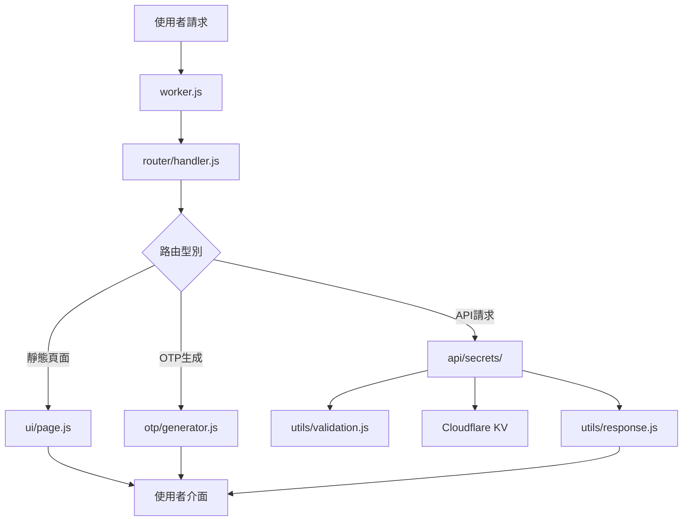

# 2FA 開發文件

## 📋 目錄

- [專案架構](#️-專案架構)
- [模組說明](#-模組說明)
- [開發環境](#️-開發環境)
- [程式碼規範](#-程式碼規範)
- [API設計](#-api設計)
- [資料庫設計](#️-資料庫設計)
- [部署](#-部署)
- [測試指南](#-測試指南)
- [效能最佳化](#-效能最佳化)
- [故障排查](#-故障排查)

## 🏗️ 專案架構

### 整體架構

```
2FA (Cloudflare Workers)
├── 前端 (HTML/CSS/JS)
│   ├── 響應式UI介面
│   ├── 即時OTP顯示
│   ├── PWA 離線支援
│   └── 二維碼掃描
├── 後端 (Worker模組)
│   ├── 路由處理
│   ├── API服務
│   ├── OTP演算法（TOTP/HOTP/Steam Guard）
│   ├── JWT 認證
│   ├── AES-GCM 加密
│   └── 資料驗證
└── 儲存 (Cloudflare KV)
    ├── 金鑰資料持久化（加密）
    └── 自動備份管理
```

### 模組化設計

以下列出主要模組，完整檔案清單以 `src/` 目錄為準。OTP 的 HMAC 和 Base32 實現在 `otp/generator.js`，資料加密使用 `utils/encryption.js`，密碼雜湊及 JWT 使用 `utils/auth.js`；加密運算呼叫 Web Crypto API。

```
src/
├── worker.js              # 🎯 Worker入口點（fetch + scheduled 處理）
├── router/
│   └── handler.js         # 🛣️ 請求路由分發
├── api/
│   ├── secrets/           # 🔌 金鑰管理API（模組化）
│   │   ├── index.js      # 統一匯出
│   │   ├── shared.js     # 共享工具（saveSecretsToKV, getAllSecrets）
│   │   ├── crud.js       # CRUD 操作（GET/POST/PUT/DELETE）
│   │   ├── batch.js      # 批次匯入
│   │   ├── backup.js     # 備份建立和列表
│   │   ├── restore.js    # 備份恢復和匯出
│   │   └── otp.js        # OTP 生成
│   └── favicon.js         # Favicon 代理
├── otp/
│   └── generator.js       # 🔐 TOTP/HOTP/Steam Guard 演算法
├── ui/
│   ├── page.js           # 🎨 主頁面 HTML 生成
│   ├── quickOtp.js       # 🔢 公開 OTP 輸入與驗證碼頁面
│   ├── setupPage.js      # 🔧 首次設定頁面
│   ├── standalone.js     # 🖥️ 獨立頁面共享 Fluent 主題
│   ├── offlinePage.js    # 📴 離線兜底頁面
│   ├── dialogIcons.js    # 🧩 對話方塊圖示
│   ├── manifest.js       # 📱 PWA Manifest
│   ├── serviceworker.js  # ⚙️ Service Worker
│   ├── scripts/          # 📜 前端 JavaScript 模組
│   │   ├── index.js     # 模組整合入口
│   │   ├── state.js     # 全域性狀態管理
│   │   ├── time.js      # 時間校準
│   │   ├── auth.js      # 認證邏輯
│   │   ├── otp.js       # OTP 計算、倒計時與交接動效
│   │   ├── ui.js        # 主題與彈窗互動
│   │   ├── search.js    # 搜尋和顯示控制
│   │   ├── settings.js  # 設定面板
│   │   ├── core.js      # 核心業務邏輯
│   │   ├── serviceAggregation.js # 服務分組
│   │   ├── utils.js     # 工具函式
│   │   ├── pwa.js       # PWA 功能
│   │   └── moduleLoader.js # 懶載入模組入口
│   └── styles/           # 🎨 前端 CSS 模組
│       ├── index.js     # 樣式整合入口
│       ├── variables.js # 主題變數與切換過渡
│       ├── base.js      # 基礎樣式
│       ├── components.js # 元件樣式
│       ├── modals.js    # 模態框樣式
│       ├── responsive.js # 響應式樣式
│       ├── progress.js   # 共享進度條常量
│       ├── workspace.js # Fluent 2 主工作區
│       ├── dialogs.js   # Fluent 2 對話方塊
│       ├── setup.js     # 首次設定頁
│       └── backupDocument.js # HTML 備份文件
└── utils/                # 🛠️ 工具函式
    ├── auth.js           # 🔑 JWT 認證（PBKDF2, HttpOnly Cookie）
    ├── backup.js         # 💾 智慧備份（事件驅動 + 併發合併 + 自動清理）
    ├── constants.js      # 📋 常量定義
    ├── encryption.js     # 🔒 AES-GCM 256 位加密
    ├── logger.js         # 📝 結構化日誌
    ├── monitoring.js     # 📊 錯誤追蹤與效能監控
    ├── rateLimit.js      # 🛡️ 請求限流
    ├── response.js       # 📡 標準化 HTTP 響應
    ├── security.js       # 🔒 CORS/CSP 安全頭
    └── validation.js     # ✅ 輸入驗證
```

### 資料流架構



## 📦 模組說明

### 1. 主入口模組 (`worker.js`)

**職責**: Cloudflare Worker的入口點，處理CORS和請求分發

**核心功能**:

- CORS預檢請求處理
- 請求路由分發
- 錯誤邊界處理
- 定時任務處理（scheduled handler）
- 資料雜湊校驗（SHA-256）

**關鍵程式碼**:

```javascript
export default {
	async fetch(request, env, ctx) {
		// 處理CORS預檢請求
		const corsResponse = handleCORS(request);
		if (corsResponse) return corsResponse;

		// 分發到路由處理器
		return handleRequest(request, env);
	},

	async scheduled(event, env, ctx) {
		// 定時備份任務
	},
};
```

### 2. 路由處理模組 (`router/handler.js`)

**職責**: HTTP請求路由解析和分發

**路由規則**:

- `/` → 主頁面 (UI模組)
- `/setup` → 首次設定頁面
- `/api/setup`、`/api/login`、`/api/refresh-token` → 首次設定與認證
- `/api/secrets`、`/api/secrets/{id}`、`/api/secrets/batch`、`/api/secrets/export` → 金鑰管理
- `/api/backup`、`/api/backup/restore`、`/api/backup/export/{backupKey}` → 備份管理
- `/api/change-password`、`/api/settings` → 密碼與系統設定
- `/api/webdav/*`、`/api/s3/*`、`/api/onedrive/*`、`/api/gdrive/*` → 遠端備份目標
- `/api/favicon/{domain}` → Favicon 代理
- `/otp`、`/otp/{secret}` → 公開 OTP 介面

**核心功能**:

- URL路徑解析
- HTTP方法處理
- JWT認證驗證
- 404錯誤處理
- API路由分發

### 3. API模組 (`api/secrets/`)

**職責**: 金鑰資料的CRUD操作

**模組化組織**:

- `shared.js` - 共享工具（saveSecretsToKV, getAllSecrets）
- `crud.js` - CRUD操作（GET/POST/PUT/DELETE）
- `batch.js` - 批次匯入
- `backup.js` - 備份建立和列表
- `restore.js` - 備份恢復和匯出
- `otp.js` - OTP生成
- `index.js` - 統一匯出

**支援的操作**:

- `GET /api/secrets` - 獲取所有金鑰
- `POST /api/secrets` - 新增新金鑰
- `PUT /api/secrets/{id}` - 更新金鑰
- `DELETE /api/secrets/{id}` - 刪除金鑰

**資料驗證**:

- Base32格式驗證
- 必填欄位檢查
- 重複性檢查

**錯誤處理**:

- 統一錯誤格式
- 詳細錯誤資訊
- HTTP狀態碼標準化

### 4. OTP生成模組 (`otp/generator.js`)

**職責**: TOTP/HOTP/Steam Guard 演算法實現

**技術規範**:

- **TOTP (RFC 6238)**: 時間步長30秒，HMAC-SHA1/SHA256/SHA512
- **HOTP (RFC 4226)**: 基於計數器，HMAC-SHA1
- **Steam Guard**: 自定義5字元編碼，字母表 `23456789BCDFGHJKMNPQRTVWXY`

**核心功能**:

- Base32金鑰解碼
- TOTP/HOTP演算法實現
- Steam Guard 編碼
- 時間同步處理
- OTPAuth URL生成

**演算法實現**:

```javascript
// TOTP核心演算法
const counter = Math.floor(Date.now() / 1000 / 30);
const hmac = await crypto.subtle.sign('HMAC', key, counterBytes);
const offset = hmac[hmac.length - 1] & 0x0f;
const binary = ((hmac[offset] & 0x7f) << 24) | ...;
const otp = binary % 1000000;
```

### 5. UI模組 (`ui/`)

**職責**: 前端頁面生成和互動邏輯

**模組組成**:

- `page.js` - 主頁面HTML生成
- `setupPage.js` - 首次設定頁面
- `manifest.js` - PWA Manifest
- `serviceworker.js` - Service Worker（快取策略）
- `scripts/` - 核心互動指令碼和按需載入的匯入、匯出、備份、二維碼及工具模組
- `styles/` - 主題變數、基礎元件、響應式佈局及 Fluent 2 頁面樣式

**前端 JavaScript 模組載入順序**:

1. `utils.js`、`state.js`、`time.js` - 通用函式、全域性狀態和校準時間
2. `auth.js`、`otp.js` - 認證和驗證碼計算/重新整理
3. `ui.js`、`search.js`、`settings.js` - 頁面互動、顯示控制和設定
4. `core.js`、`serviceAggregation.js` - 金鑰業務流程和服務分組
5. `pwa.js`、`moduleLoader.js`、`versionCheck.js` - PWA、按需模組和版本檢查

匯入、匯出、備份、二維碼、Google 遷移和工具程式碼由 `moduleLoader.js` 按需載入；傳統完整模式則由 `scripts/index.js` 按依賴順序一次性拼接。

**Service Worker 快取策略**:

- **主頁** (`/`): Network First；網路失敗時返回快取，快取也不存在時返回離線頁
- **Favicon 代理**: Cache First
- **CDN 庫** (jsQR, qrcode): 快取命中後後臺更新，首次請求使用 CORS 獲取並快取
- **API 請求**（Favicon 代理除外）: 請求網路，不快取響應；支援的金鑰寫操作遇到網路錯誤時進入離線同步佇列，其他 API 返回錯誤
- **其他同源資源**: Network Only；網路錯誤時返回 503，無 Service Worker 快取回退
- **其他外部資源**: Network Only；網路錯誤時返回空 404，無 Service Worker 快取回退
- 快取名由部署版本生成：`2fa-cache-${SW_VERSION}`

**頁面結構**:

```
頁面元件
├── 頭部區域 (Logo)
├── 搜尋區域 (即時搜尋)
├── 顯示控制 (智慧聚合/平鋪/排序)
├── 金鑰列表 (卡片與服務分組)
├── 懸浮操作入口 (新增/掃描/匯入/匯出/設定)
└── 模態框 (金鑰、工具、同步、還原和偏好設定)
```

### 6. 工具模組 (`utils/`)

#### 認證模組 (`utils/auth.js`)

**職責**: JWT認證，PBKDF2密碼雜湊

**關鍵特性**:

- JWT tokens 儲存在 HttpOnly, Secure, SameSite=Strict cookies
- Token 預設有效期 30 天（可在設定中自定義），剩餘不足 7 天時自動續期
- 首次使用通過 `/setup` 設定密碼

#### 加密模組 (`utils/encryption.js`)

**職責**: AES-GCM 256位加密/解密

**關鍵特性**:

- 使用 Web Crypto API (`crypto.subtle`)
- 96位 IV + 128位認證標籤
- 金鑰為 256位（32位元組）base64編碼
- 加密資料格式: `__ENCRYPTED__<base64-encoded-json>`
- 自動檢測加密/明文資料

#### 備份模組 (`utils/backup.js`)

**職責**: 智慧備份管理

**策略**:

- **事件驅動**: 資料變更後自動觸發；有請求上下文時通過 `ctx.waitUntil()` 轉入後臺執行
- **定時任務**: 每天一次 cron 兜底檢查（僅在資料變化時通過 SHA-256 雜湊比較）
- **自動清理**: 保留最新100個備份

#### 限流模組 (`utils/rateLimit.js`)

**職責**: 滑動視窗限流

**預設**:

`RATE_LIMIT_PRESETS` 提供可複用配置，只有呼叫限流邏輯的處理器才應用相應限制，不能把預設視為所有端點的預設限額。各端點實際配置見 [API 參考的速率限制說明](API_REFERENCE.md#rate-limiting)。

#### 驗證模組 (`utils/validation.js`)

**職責**: 資料格式驗證和業務邏輯驗證

**驗證規則**:

- Base32格式: `[A-Z2-7]+=*$`
- 最小長度: 8字元
- 服務名稱: 非空字串
- 資料完整性檢查

#### 響應模組 (`utils/response.js`)

**職責**: 標準化HTTP響應格式

**響應型別**:

- JSON響應 (API資料)
- 錯誤響應 (統一錯誤格式)
- HTML響應 (頁面內容)
- 成功響應 (操作確認)

**標準格式**:

```javascript
// 成功響應
{
  "success": true,
  "data": {...},
  "message": "操作成功"
}

// 錯誤響應
{
  "error": "錯誤標題",
  "message": "詳細錯誤資訊",
  "timestamp": "2023-12-07T10:30:00.000Z"
}
```

## 🛠️ 開發環境

### 環境要求

- **Node.js**: >= 16.0.0
- **npm**: >= 8.0.0
- **Wrangler CLI**: >= 3.0.0
- **Cloudflare賬戶**: 用於部署和KV儲存

### 本地開發設定

1. **克隆專案**:

```bash
git clone <repository-url>
cd 2fa
```

2. **安裝依賴**:

```bash
npm install
```

3. **配置環境**:

```bash
# 登入Cloudflare
npx wrangler login

# 建立KV儲存
npx wrangler kv namespace create SECRETS_KV
npx wrangler kv namespace create SECRETS_KV --preview
```

4. **啟動開發伺服器**:

```bash
npm run dev
# 或
npx wrangler dev --port 8787
```

### 開發工具配置

**VS Code推薦擴充套件**:

- ES6 String HTML
- Prettier
- ESLint
- Thunder Client (API測試)

**配置檔案** (`.vscode/settings.json`):

```json
{
	"editor.formatOnSave": true,
	"editor.defaultFormatter": "esbenp.prettier-vscode",
	"files.associations": {
		"*.js": "javascript"
	}
}
```

## 📝 程式碼規範

### JavaScript規範

**模組匯入/匯出**:

```javascript
// ✅ 推薦 - 命名匯出
export function functionName() {}
export const CONSTANT_NAME = 'value';

// ✅ 推薦 - 命名匯入
import { specificFunction } from './module.js';

// ❌ 避免 - 預設匯出 (除了Worker入口)
export default something;
```

**函式命名**:

```javascript
// ✅ 動詞開頭，駝峰命名
function handleRequest() {}
function validateData() {}
function createResponse() {}

// ✅ 布林值返回用is/has開頭
function isValidSecret() {}
function hasPermission() {}
```

**錯誤處理**:

```javascript
// ✅ 推薦 - 具體的錯誤資訊
try {
	await operation();
} catch (error) {
	console.error('Operation failed:', error);
	return createErrorResponse('操作失敗', error.message);
}

// ❌ 避免 - 忽略錯誤
try {
	await operation();
} catch (error) {
	// 不處理錯誤
}
```

**註釋規範**:

```javascript
/**
 * 函式描述
 * @param {Type} paramName - 引數描述
 * @returns {Type} 返回值描述
 */
function exampleFunction(paramName) {
	// 行內註釋說明業務邏輯
	return result;
}
```

### CSS規範

**命名約定**:

```css
/* ✅ BEM命名方式 */
.secret-card {
}
.secret-card__header {
}
.secret-card__header--active {
}

/* ✅ 功能性類名 */
.btn-primary {
}
.text-center {
}
.hidden {
}
```

**響應式設計**:

```css
/* 移動優先設計 */
.component {
	/* 基礎樣式 */
}

@media (min-width: 481px) {
	.component {
		/* 平板樣式 */
	}
}

@media (min-width: 1200px) {
	.component {
		/* 桌面樣式 */
	}
}
```

### HTML規範

**語義化標籤**:

```html
<!-- ✅ 推薦 -->
<main class="content">
	<section class="secrets-list">
		<article class="secret-card">
			<header class="card-header">
				<h3>服務名稱</h3>
			</header>
		</article>
	</section>
</main>
```

**無障礙設計**:

```html
<!-- ✅ 推薦 -->
<button aria-label="複製驗證碼" title="點選複製">
	<span aria-hidden="true">📋</span>
</button>

<input type="text" aria-describedby="help-text" />
<div id="help-text">輸入幫助資訊</div>
```

## 🔌 API設計

### RESTful API規範

**端點設計**:

```
GET    /api/secrets          # 獲取所有金鑰
POST   /api/secrets          # 建立新金鑰
PUT    /api/secrets/{id}     # 更新金鑰
DELETE /api/secrets/{id}     # 刪除金鑰
POST   /api/secrets/batch    # 批次匯入
POST   /api/secrets/export   # 批次匯出標準 TXT/JSON/CSV/HTML
GET    /api/backup           # 獲取備份列表
POST   /api/backup           # 建立備份
POST   /api/backup/restore   # 預覽/恢復備份
GET    /api/backup/export/{backupKey} # 匯出備份
POST   /api/change-password  # 修改密碼
GET    /api/settings         # 讀取設定
POST   /api/settings         # 儲存設定
GET    /otp/{secret}         # 公開 OTP（可加 ?format=json）
```

**請求格式**:

```javascript
// POST/PUT 請求體
{
  "name": "GitHub",           // 必填 - 服務名稱
  "service": "user@email.com", // 可選 - 賬戶名稱
  "secret": "JBSWY3DPEHPK3PXP" // 必填 - Base32金鑰
}
```

**響應格式**:

```javascript
// 成功響應
{
  "id": "uuid-string",
  "name": "GitHub",
  "account": "user@email.com",
  "secret": "JBSWY3DPEHPK3PXP",
  "createdAt": "2023-12-07T10:30:00.000Z",
  "updatedAt": "2023-12-07T10:30:00.000Z"
}

// 錯誤響應
{
  "error": "驗證失敗",
  "message": "金鑰格式無效，必須是有效的Base32格式",
  "timestamp": "2023-12-07T10:30:00.000Z"
}
```

### HTTP狀態碼規範

| 狀態碼 | 場景           | 說明                 |
| ------ | -------------- | -------------------- |
| 200    | GET成功        | 資料獲取成功         |
| 201    | POST成功       | 資源建立成功         |
| 204    | PUT/DELETE成功 | 操作成功，無返回內容 |
| 400    | 請求錯誤       | 引數驗證失敗         |
| 401    | 未認證         | JWT token 缺失或過期 |
| 404    | 資源不存在     | 金鑰ID不存在         |
| 409    | 衝突           | 重複的服務和賬戶組合 |
| 429    | 請求過多       | 觸發限流             |
| 500    | 伺服器錯誤     | 內部處理錯誤         |

## 🗄️ 資料庫設計

### KV儲存結構

**主鍵設計**:

```
secrets → 儲存所有金鑰的陣列（加密儲存）
backup:<timestamp> → 備份資料
data_hash → 資料變更檢測雜湊
```

**資料模型**:

```javascript
// 金鑰物件結構
{
  "id": "uuid-v4",              // 唯一識別符號
  "name": "服務名稱",            // 顯示名稱
  "account": "賬戶名稱",         // 可選的賬戶資訊
  "secret": "BASE32SECRET",     // Base32編碼的金鑰
  "type": "totp",               // 型別: totp/hotp/steam
  "algorithm": "SHA1",          // 雜湊演算法
  "digits": 6,                  // OTP位數
  "period": 30,                 // 時間步長（秒）
  "createdAt": "ISO8601時間戳",  // 建立時間
  "updatedAt": "ISO8601時間戳"   // 更新時間
}

// 儲存在KV中的資料結構（加密後）
// __ENCRYPTED__<base64-encoded-json>
// 解密後為陣列:
[
  {金鑰物件1},
  {金鑰物件2},
  ...
]
```

### 資料操作模式

**讀取操作**:

```javascript
// 獲取所有金鑰（自動解密）
const secrets = await getAllSecrets(env);
```

**寫入操作**:

```javascript
// 儲存所有金鑰（自動加密 + 觸發備份）
await saveSecretsToKV(env, secrets);
```

**資料遷移**:

```javascript
// 版本相容性處理
function migrateSecrets(secrets) {
	return secrets.map((secret) => ({
		...secret,
		id: secret.id || generateUUID(),
		createdAt: secret.createdAt || new Date().toISOString(),
		updatedAt: secret.updatedAt || new Date().toISOString(),
	}));
}
```

## 🚀 部署

詳細的部署指南請參考 [部署文件](DEPLOYMENT.md)，包括：

- 一鍵部署（GitHub 按鈕）
- 命令列部署
- 自定義域名和環境變數配置

## 🧪 測試指南

### 測試框架

本專案使用 [Vitest](https://vitest.dev/) 作為測試框架。測試數量會隨功能增長，以 `npm test` 的當次輸出為準，避免在文件中維護易過期的固定數字。

### 執行測試

```bash
npm test              # 執行所有測試
npm run test:watch    # 監聽模式（開發時使用）
npm run test:coverage # 生成覆蓋率報告（V8 provider）
npm run test:ui       # Vitest UI 介面
```

### 測試目錄結構

測試檔案位於 `tests/` 目錄，按模組組織。覆蓋率排除了 `src/ui/**` 和 `src/worker.js`。

### 編寫測試

```javascript
import { describe, it, expect } from 'vitest';
import { yourFunction } from '../src/utils/yourModule.js';

describe('yourFunction', () => {
	it('should work correctly', () => {
		expect(yourFunction('input')).toBe('expected');
	});
});
```

### API測試

**使用curl測試**:

```bash
# 獲取所有金鑰（需要認證）
curl -b cookies.txt https://your-worker.workers.dev/api/secrets

# 新增新金鑰
curl -b cookies.txt -X POST https://your-worker.workers.dev/api/secrets \
  -H "Content-Type: application/json" \
  -d '{"name":"Test","secret":"JBSWY3DPEHPK3PXP"}'
```

### 前端測試

**手動測試清單**:

- [ ] 頁面載入和渲染
- [ ] 金鑰增刪改查
- [ ] OTP即時更新
- [ ] 二維碼掃描功能
- [ ] 搜尋和過濾
- [ ] 批次匯入/匯出
- [ ] 主題切換
- [ ] 移動端適配
- [ ] PWA 安裝和離線功能

**瀏覽器相容性測試**:

- Chrome (最新版本)
- Firefox (最新版本)
- Safari (iOS/macOS)
- Edge (最新版本)

## ⚡ 效能最佳化

### 前端最佳化

**資源最佳化**:

- 內聯CSS和JavaScript (減少請求數，零外部依賴)
- 圖片使用Data URL或SVG
- 啟用Gzip壓縮

**渲染最佳化**:

```javascript
// 虛擬滾動 (大量金鑰時)
function renderVisibleSecrets() {
	const visibleStart = Math.floor(scrollTop / itemHeight);
	const visibleEnd = Math.min(visibleStart + visibleCount, secrets.length);
	// 只渲染可見範圍內的金鑰卡片
}

// 防抖搜尋
const searchDebounced = debounce(filterSecrets, 300);
```

**記憶體管理**:

```javascript
// 清理定時器
window.addEventListener('beforeunload', () => {
	Object.values(otpIntervals).forEach(clearInterval);
});

// 事件委託
document.addEventListener('click', (e) => {
	if (e.target.matches('.copy-btn')) {
		handleCopy(e.target.dataset.secretId);
	}
});
```

### 後端最佳化

**KV儲存最佳化**:

```javascript
// 批次操作
async function batchUpdateSecrets(operations) {
	// 一次性讀取，批次處理，一次性寫入
	const secrets = await getAllSecrets(env);
	operations.forEach((op) => applyOperation(secrets, op));
	await saveSecretsToKV(env, secrets);
}
```

**備份最佳化**:

```javascript
// SHA-256 雜湊比較避免不必要的備份
// 雜湊計算排除 createdAt/updatedAt 欄位以避免誤報
const currentHash = await generateDataHash(secrets);
const lastHash = await env.SECRETS_KV.get('data_hash');
if (currentHash !== lastHash) {
	await createBackup(env, secrets);
}
```

### 監控和分析

**效能指標**:

- 頁面載入時間 (< 2秒)
- API響應時間 (< 500ms)
- OTP生成時間 (< 100ms)
- 記憶體使用量 (< 50MB)

**日誌記錄**:

```javascript
// 結構化日誌（使用 utils/logger.js）
const logger = getLogger(env);
logger.info('Operation completed', { duration: elapsed, operation: 'backup' });

// 錯誤追蹤（使用 utils/monitoring.js）
monitoring.captureError(error, { operation: 'backup' });
```

## 🔧 故障排查

### 常見問題

**1. KV儲存問題**:

```javascript
// 問題: KV儲存未正確配置
// 解決: 檢查wrangler.toml配置
if (!env.SECRETS_KV) {
	throw new Error('SECRETS_KV binding not configured');
}
```

**2. CORS問題**:

```javascript
// 問題: 跨域請求被阻止
// 解決: 確保CORS頭正確設定（見 utils/security.js）
headers: {
  'Access-Control-Allow-Origin': '*',
  'Access-Control-Allow-Methods': 'GET, POST, PUT, DELETE, OPTIONS',
  'Access-Control-Allow-Headers': 'Content-Type'
}
```

**3. OTP時間同步問題**:

```javascript
// 問題: OTP與手機應用不匹配
// 解決: 檢查伺服器時間同步
const serverTime = Math.floor(Date.now() / 1000);
const expectedTime = Math.floor(serverTime / 30) * 30;
console.log('Server time alignment:', serverTime - expectedTime);
```

**4. 加密相關問題**:

```javascript
// 問題: 無法解密已有資料
// 解決: 確保 ENCRYPTION_KEY 未被更改
// 系統自動檢測加密/明文資料，無需手動干預

// 問題: 修改資料後未觸發備份
// 解決: 確保使用 saveSecretsToKV() 而非直接寫入 KV
```

**5. 認證問題**:

```javascript
// 問題: JWT token 過期
// 解決: 前端使用 authenticatedFetch() 自動處理重新整理

// 問題: 首次設定密碼失敗
// 解決: 檢查密碼複雜度要求（8位+大小寫+數字+特殊字元）
```

### 除錯工具

**開發環境除錯**:

```bash
# 啟動開發伺服器（自動熱過載）
npm run dev

# 即時檢視 Worker 日誌
npx wrangler tail
npx wrangler tail --format=pretty

# 過濾錯誤日誌
npx wrangler tail --grep "ERROR"
```

**KV儲存檢查**:

```bash
# 檢視KV資料
npx wrangler kv key list --namespace-id=your-namespace-id

# 獲取特定鍵值
npx wrangler kv key get "secrets" --namespace-id=your-namespace-id
```

**生產環境監控**:

```bash
# 檢視 Worker 即時日誌
npx wrangler tail --env production

# 檢查金鑰配置
npx wrangler secret list
```

## 📈 專案維護

### 版本管理

**語義化版本控制**:

- 主版本號: 不相容的API修改
- 次版本號: 向下相容的功能性新增
- 修訂號: 向下相容的問題修正

**釋出流程**:

1. 更新版本號
2. 更新CHANGELOG.md
3. 執行測試套件 (`npm test`)
4. 部署到測試環境
5. 部署到生產環境
6. 建立Git標籤

### 依賴管理

**定期更新**:

```bash
# 檢查過時的依賴
npm outdated

# 更新依賴
npm update

# 安全審計
npm audit
```

### 文件維護

**文件更新原則**:

- 程式碼變更同步更新文件
- API變更必須更新介面文件
- 新功能必須新增使用說明
- 定期審查文件的準確性

---

## 📞 技術支援

如有開發相關問題，請：

1. 查閱本文件和相關文件
2. 檢查專案的Issue列表
3. 提交詳細的Bug報告或功能請求

**相關文件**:

- **[架構詳解](ARCHITECTURE.md)** - 深入的架構設計和模式說明
- **[API 參考](API_REFERENCE.md)** - 完整的 API 端點文件
- **[部署指南](DEPLOYMENT.md)** - 部署和運維指南
- **[PWA 指南](PWA_GUIDE.md)** - PWA 安裝和離線功能

**貢獻指南**: 歡迎提交Pull Request來改進專案！

---
